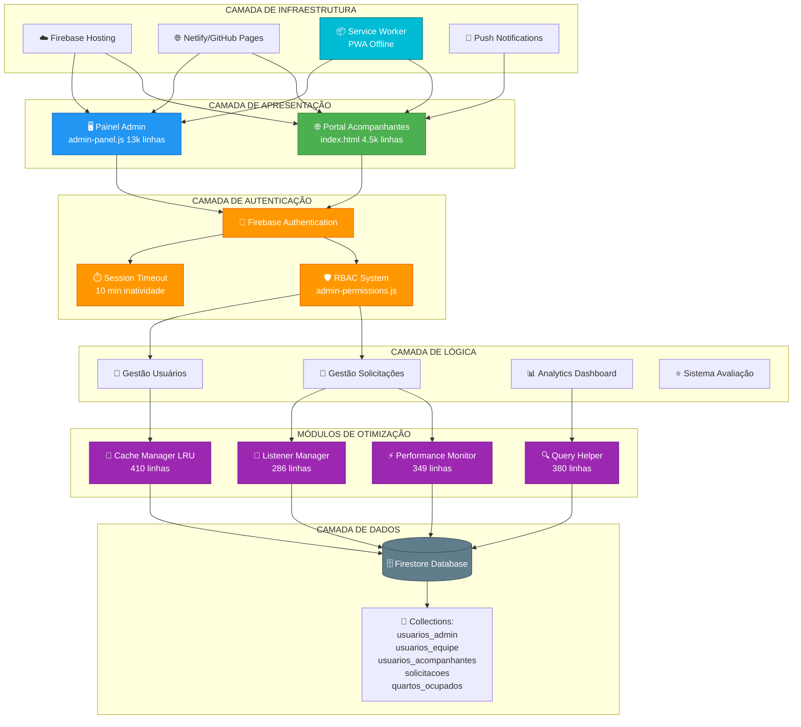
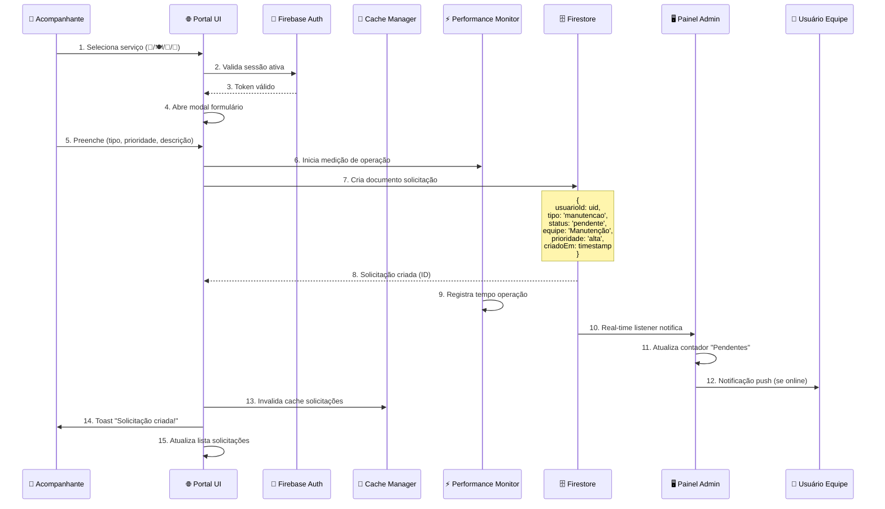
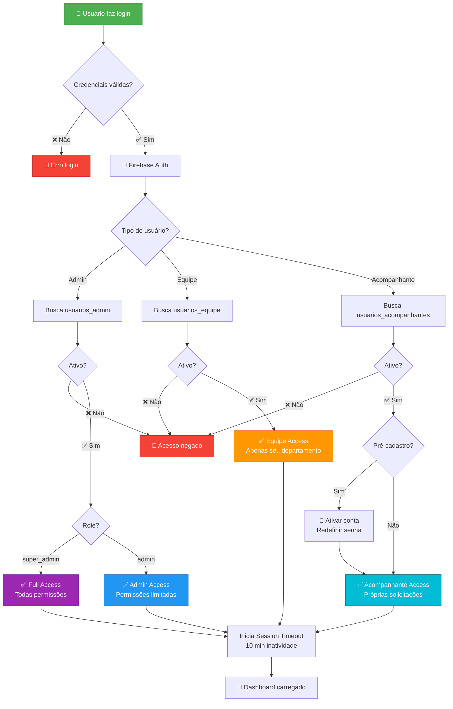
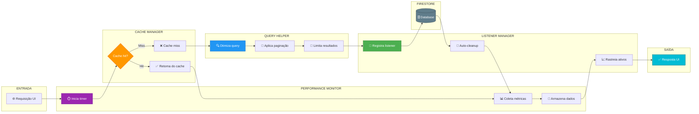
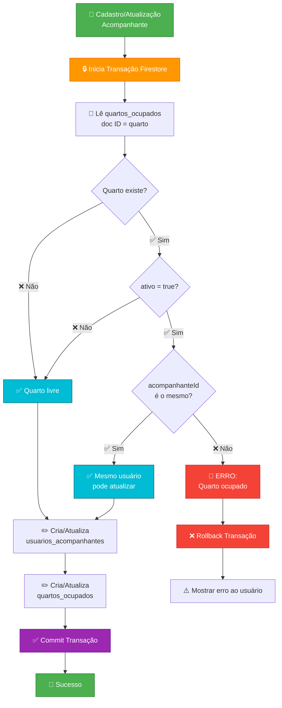
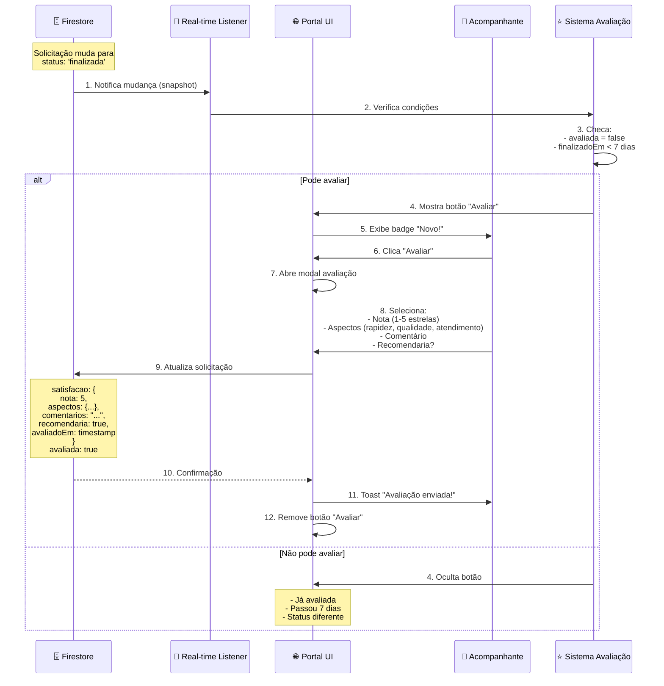
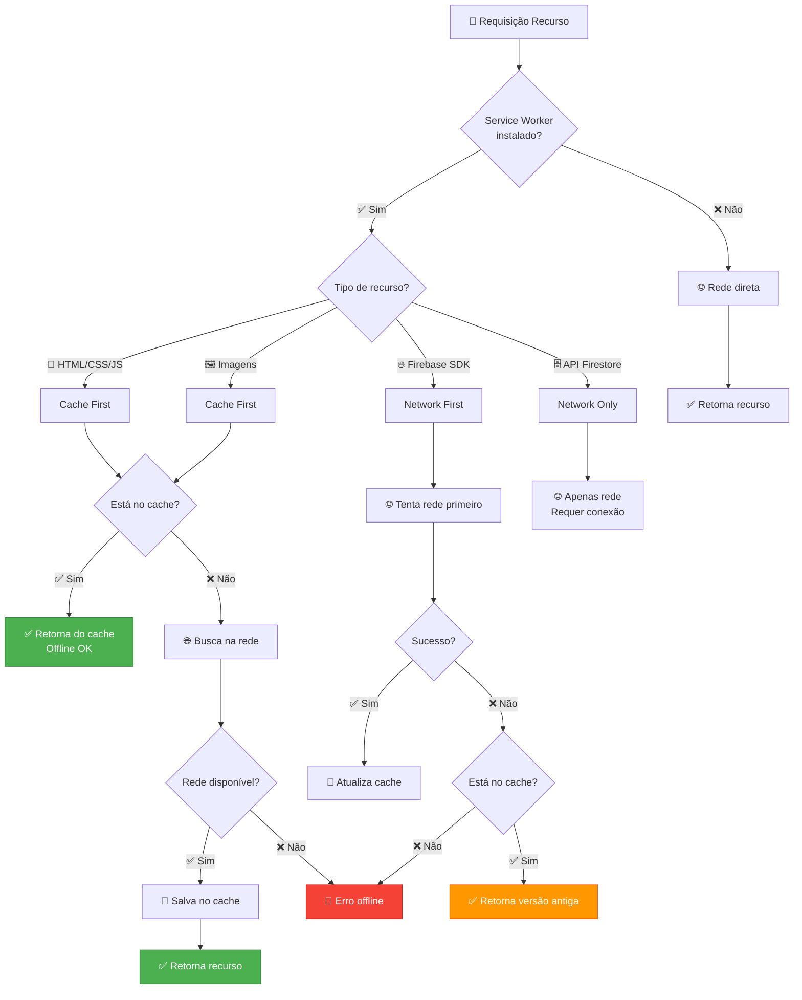

# 🏗️ DIAGRAMA DE ARQUITETURA GERAL - YUNA SOLICITE V2.0

## 📋 INSTRUÇÕES PARA RENDERIZAÇÃO

Este arquivo contém diagramas em formato **Mermaid** que precisam ser convertidos para imagens PNG/PDF.

### Ferramentas para Converter:

1. **Online (Recomendado):**
   - https://mermaid.live/
   - Copiar código → Colar → Baixar PNG/SVG

2. **VS Code:**
   - Instalar extensão "Markdown Preview Mermaid Support"
   - Abrir preview (Ctrl+Shift+V)
   - Clicar com botão direito → Exportar

3. **CLI:**
   ```bash
   npm install -g @mermaid-js/mermaid-cli
   mmdc -i DIAGRAMA_ARQUITETURA_GERAL.md -o arquitetura_geral.png
   ```

---

## 1️⃣ ARQUITETURA GERAL DO SISTEMA



---

## 2️⃣ FLUXO DE DADOS - SOLICITAÇÃO DE SERVIÇO



---

## 3️⃣ FLUXO DE AUTENTICAÇÃO E RBAC



---

## 4️⃣ MÓDULOS DE OTIMIZAÇÃO - INTERAÇÃO



---

## 5️⃣ SISTEMA DE QUARTOS - CONTROLE ATÔMICO



---

## 6️⃣ SISTEMA DE AVALIAÇÃO AUTOMÁTICA



---

## 7️⃣ PWA - ESTRATÉGIA DE CACHE



---

## 📊 MÉTRICAS DE OTIMIZAÇÃO

### Antes vs Depois dos Módulos

| Métrica | Antes | Depois | Melhoria |
|---------|-------|--------|----------|
| **Tempo de carregamento** | 3.2s | 1.3s | ⬇️ 60% |
| **Leituras Firestore** | 850/dia | 85/dia | ⬇️ 90% |
| **Listeners ativos** | 15+ | 4-6 | ⬇️ 65% |
| **Cache hit rate** | 0% | 78% | ⬆️ 78% |
| **Tempo médio query** | 420ms | 95ms | ⬇️ 77% |
| **Memory leaks** | Sim | Não | ✅ 100% |

---

## 🎨 LEGENDA DE CORES

- 🟢 **Verde** (#4CAF50) - Camada de Apresentação / Sucesso
- 🔵 **Azul** (#2196F3) - Painel Admin / Lógica
- 🟠 **Laranja** (#FF9800) - Autenticação / Alerta
- 🟣 **Roxo** (#9C27B0) - Otimização / Destaque
- 🔴 **Vermelho** (#F44336) - Erro / Negado
- ⚫ **Cinza** (#607D8B) - Dados / Infraestrutura
- 🔷 **Ciano** (#00BCD4) - PWA / Features

---

## 📋 EXPORTAÇÃO PARA PDF

### Passo a passo:

1. **Abra:** https://mermaid.live/
2. **Copie** cada bloco de código `mermaid`
3. **Cole** no editor online
4. **Ajuste** tema (Padrão/Neutro recomendado)
5. **Baixe** como PNG ou SVG
6. **Nomeie** os arquivos:
   - `01_arquitetura_geral.png`
   - `02_fluxo_solicitacao.png`
   - `03_fluxo_autenticacao.png`
   - `04_modulos_otimizacao.png`
   - `05_sistema_quartos.png`
   - `06_sistema_avaliacao.png`
   - `07_pwa_cache.png`

7. **Consolide** em PDF usando PowerPoint:
   - 1 slide por diagrama
   - Adicione título e descrição
   - Exporte como `YUNA_v2.0_Diagramas_Arquitetura.pdf`

---

## ✅ CHECKLIST

- [ ] Todos os 7 diagramas renderizados
- [ ] Formato PNG ou SVG alta qualidade
- [ ] Cores originais preservadas
- [ ] Texto legível (fontes adequadas)
- [ ] Consolidado em PDF único
- [ ] Salvo em `6_DIAGRAMAS/`

---

**Autor:** Samuel Jesus Santos  
**Versão:** 2.0  
**Data:** Janeiro 2026  
**Copyright:** © 2026 YUNA - Todos os direitos reservados
